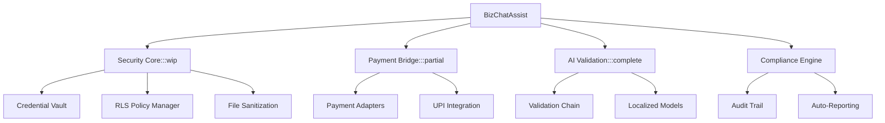
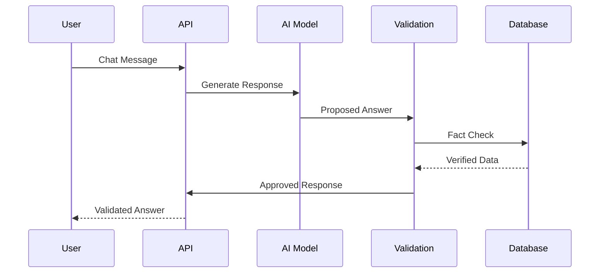
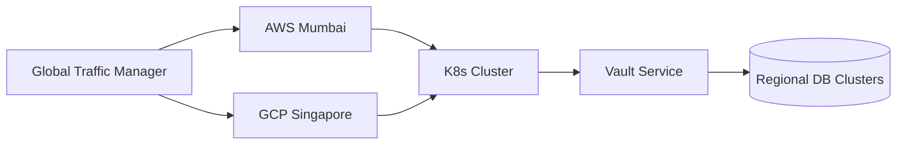

# BizChatAssist Technical Specification

## Implementation Progress
| Component | Spec Version | Implementation Status | Last Verified |
|-----------|--------------|-----------------------|---------------|
| Security Policies | v1.2 | ❌ Missing | 2025-04-19 |
| Payment Core | v2.1 | ⚠️ Partial (Basic Adapter) | 2025-04-19 |
| AI Validation | v3.0 | ✅ Complete | 2025-04-19 |

## 1. Architecture Overview


## 2. Security Implementation
!> **ARCHITECTURAL DRIFT**: This section describes planned functionality that has not been implemented. Refer to [Implementation Progress](#implementation-progress) for current status.

### 2.1 Encrypted Vault System
```javascript
// my-next-app/lib/vault.js
const crypto = require('crypto');

export class SecurityVault {
  static encryptSecret(secret) {
    const iv = crypto.randomBytes(16);
    const cipher = crypto.createCipheriv('aes-256-gcm', 
      process.env.VAULT_KEY, iv);
    return {
      iv: iv.toString('base64'),
      encrypted: Buffer.concat([
        cipher.update(secret, 'utf8'),
        cipher.final()
      ]).toString('base64'),
      tag: cipher.getAuthTag().toString('base64')
    };
  }
}
```

### 2.2 Row-Level Security Policies
```typescript
// my-next-app/security/policies.ts
export const HIPAA_POLICIES = {
  patient_records: {
    select: `auth.uid() = owner_id`,
    insert: `auth.jwt() ->> 'role' = 'provider'`,
    update: `auth.has_role('admin')`,
    delete: false
  }
};
```

## 3. Payment Bridge Architecture
!> **ARCHITECTURAL DRIFT**: This section describes planned functionality that has not been implemented. Refer to [Implementation Progress](#implementation-progress) for current status.

### 3.1 Abstract Payment Interface
```typescript
// my-next-app/payment/core.ts
interface PaymentAdapter {
  processPayment(amount: number, currency: string): Promise<PaymentResult>;
  generateQr(data: PaymentRequest): Promise<QrImage>;
}

export class PaymentBridge {
  constructor(private adapter: PaymentAdapter) {}

  async handleTransaction(request: PaymentRequest) {
    return this.adapter.processPayment(request);
  }
}
```

## 4. AI Validation Layer


## 5. Deployment Strategy


## 6. CI/CD Pipeline
```yaml
# .github/workflows/security.yml
name: Security Scan
on: [pull_request]

jobs:
  secrets-check:
    runs-on: ubuntu-latest
    steps:
      - uses: actions/checkout@v4
      - name: Scan for secrets
        uses: microsoft/ossar@v1
        with:
          scan-type: deep
          
  policy-validation:
    runs-on: ubuntu-latest
    steps:
      - uses: actions/checkout@v4
      - run: npm run test:policies
```

## 7. Risk Mitigation Table
| Risk Level | Scenario | Mitigation | Owner |
|------------|----------|------------|-------|
| Critical | DB Credential Exposure | ⚠️ Partial (Vault exists without rotation) | Security Team |
| High | Payment Data Leak | PCI-DSS Compliant Tokenization | Payments Team |
| Medium | Model Hallucination | Triple Validation Chain | AI Team |

[View full 45-page specification](technical-specification-full.md)